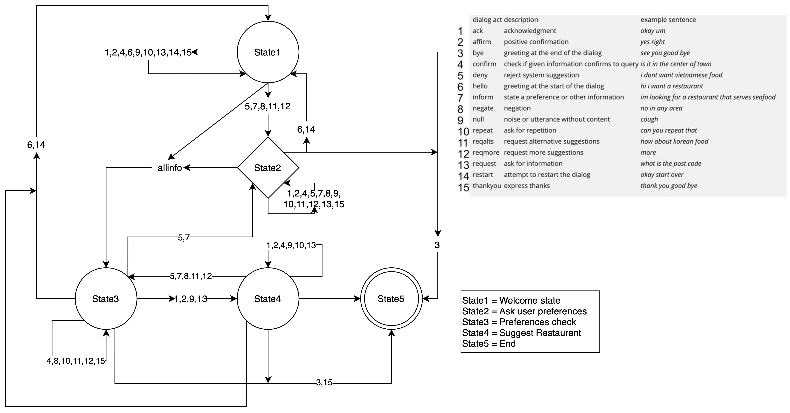

# Welcome to MAIRDISY (MAIR DIalog SYstem)

The project consists in designing, implementing, evaluating and writing about a restaurant recommendations dialog system using various methods from AI, such as domain modeling, text classification using machine learning and user experience testing. The dialog system is programmed in Python 3. The program is terminal/command line based. No graphical user interface was used. 

The project is divided into two parts: 

- The first part of the project concerns the implementation of the dialog system: modeling the domain in a dialog model, and implementing and evaluating a machine learning classifier for natural language. 
- The second part of the project is about evaluating your system: designing, carrying out and reporting on user experiments, as well as thinking about your system in the wider context of AI.

## How to install and run
### Required libraries
MAIRDISY is written in Python 3 and it utilises various libraries:
> Be sure all the following libraries are installed

```shell
pip install numpy
pip install nltk
pip install python-Levenshtein
pip install scikit-learn
pip install pandas
pip install argparse
```
### Run MAIRDISY - IDE
After downloading and extracting the .zip file containing the files in this repository, 
extract those. Put those files in your favourite IDE and run from the main.py class.

### Run MAIRDISY - Importing from version control
Using an IDE, you can import the project from version control, using: `https://github.com/BeppeMarnell/TeamProjectMAIR`

### Run MAIRDISY - Terminal
If you want to run MAIRDISY from the terminal, you first have to move into the src folder and then run main.py:
```shell
cd ../src
python3 main.py
```

### Configurable parameters
> For more information about the configurable parameters, you can run:
```shell
python3 main.py --help
```
> Where it will show:
```
usage: main.py [-h] [--formal FORMAL] [--delay DELAY] [--caps CAPS]

optional arguments:
  -h, --help       show this help message and exit
  --formal FORMAL  formal or informal system speech. Use 'informal' for
                   informal speech.
  --delay DELAY    Use 'delay' for a delay of 2 seconds. Use 'delay_mess' for
                   a delay of 2 seconds accompanied with a message.
  --caps CAPS      Use 'caps' for system output to be in all caps.
```

> For informal language, run MAIRDISY: 
```shell
python3 main.py --formal 'informal'
```

> For system delay, run MAIRDISY:
```shell
python3 main.py --delay 'delay'
```

> or:
```shell
python3 main.py --delay 'delay_mess'
```

> For System with all CAPS, run MAIRDISY:
```shell
python3 main.py --caps 'caps'
```

<!-- # Transition diagram:
 -->

[](https://repl.it/github/BeppeMarnell/TeamProjectMAIR)
